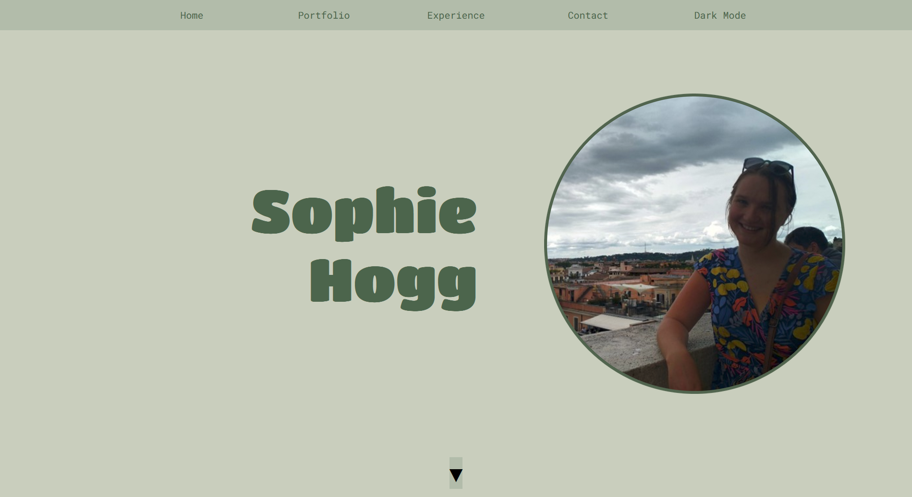
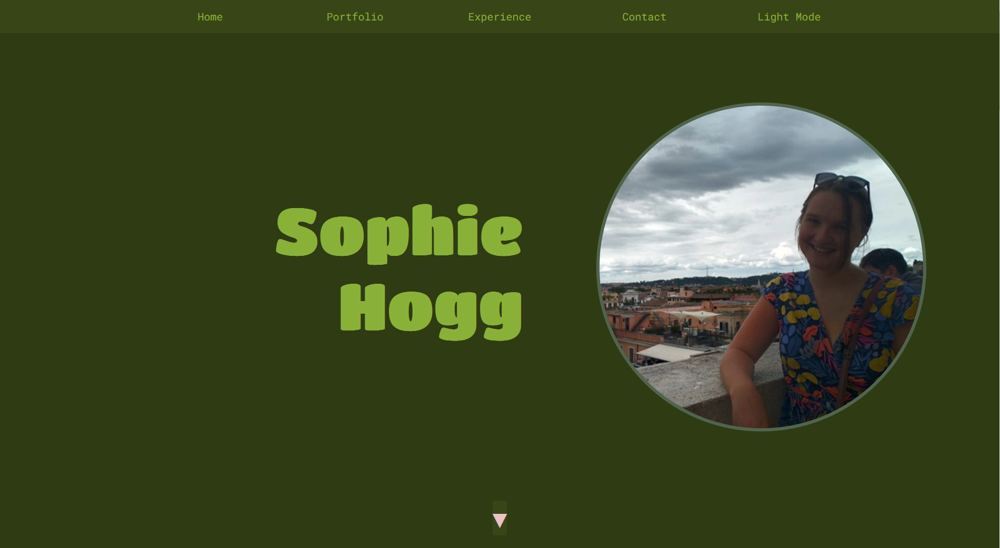

# Portfolio Website Project

## A website showcasing my achievements, my projects, and my personality

This project was completed using HTML, CSS and JavaScript as part of my time at \_nology.

## Design and Structure

I enjoy taking my colour palettes from Australian flora. This is a unifying factor throughout all of my personal projects. In this case, I used the palette based the foliage and bark of Australian gum trees, with a lot of faded greens and pale grey-brown colours.

My portfolio is a single page, navigable with arrows or by scrolling, or by using the navigation bar at the top of the page. Each section of the page is divided into one screen for the user, with alternating colours used for alternating sections to provide a clear line between topics and pages.

There is also (as of 14/09) a dark mode option, which will change the palette to deep rainforesty colours. The button name will also change upon clicking.

### Responsiveness

The page works on all screen sizes, even very narrow phone screens (all the way down to about 290 px wide.)
I have tested the website using placeholder devices provided by Google Chrome and Firefox and all display the website without any glitches. Text and images will resize and at very narrow widths, the image on the home screen will disappear to allow for this flexibility.

## What I would like to add with more time

-   A dark mode implemented with JavaScript. This could turn the page into more of a rainforesty/dark and dappled look.
-   More decoration for the empty spaces on the page, e.g. more images, more little flourishes, etc.
-   Adding icons for languages used in the projects section, as opposed to writing them out.
-   Potentially some minor animations
-   Links to Github and LinkedIn at the bottom of the page

## Updates 14/09:

-   implemented dark mode, using lots of bright and dark greens with some yellows, browns and pale pinks for some contrast
-   added links for Github and LinkedIn using colour-changing icons.
-   added icons for the tech stacks used in portfolio projects.
-   changed font from Arial and added some new fonts from Google Fonts
-   added coloured favicon and changed name in tab

### Dark Mode:

### Still To Add

-   Minor animations (underline animation in nav bar would be a good place to start!)
